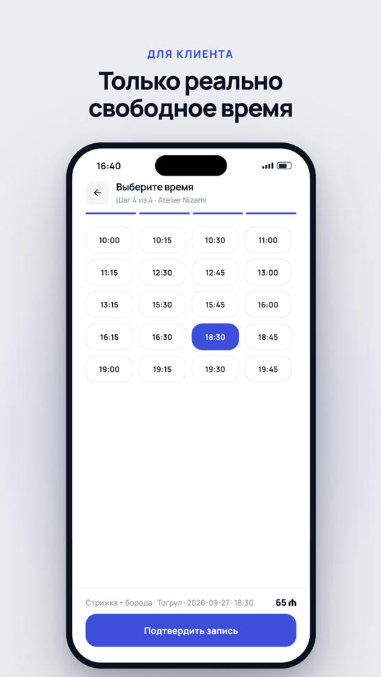

# SalonHub

**Online booking for Baku salons — only genuinely free time slots.**

SalonHub is a mobile marketplace for beauty salons and barbershops in Baku. A client finds a salon, picks a service, a master and a time that is actually free, and gets a push confirmation. The salon sees the booking straight away in its own calendar — in the same app, in business mode.

> The working name in the code and in the repository is **BookSpot**; SalonHub is the product name for release.

<p align="center">
  <a href="docs/media/salonhub-promo.mp4">
    
  </a>
  <br>
  <sub>▶ Promo video (20 s, 1080×1920) — click the image</sub>
</p>

---

## Contents

- [Why it exists](#why-it-exists)
- [Features](#features)
- [Tech stack](#tech-stack)
- [How it works](#how-it-works)
- [Repository structure](#repository-structure)
- [Getting started](#getting-started)
- [Database and migrations](#database-and-migrations)
- [Push notifications](#push-notifications)
- [Verification scripts](#verification-scripts)
- [Project conventions](#project-conventions)
- [Status and release checklist](#status-and-release-checklist)

---

## Why it exists

Booking a salon in Baku today means a phone call, "call back later" and chatting in a messenger. SalonHub changes that:

- **for clients** — "find free time, not just a salon": the app shows only the slots a master can really take, based on their schedule, days off and existing bookings;
- **for salons** — "fill the schedule, not just collect requests": bookings land in the calendar instantly, no-shows and completed visits are marked in a couple of taps, and client reviews build the salon's rating.

The full product concept, roadmap and monetization model are in [`product-concept.md`](product-concept.md) (in Russian).

## Features

One app, two modes. Every user is a client; if the account owns a business, a **Client ⇄ Business** switch appears in the profile.

### Client

| Feature | Where in the code |
|---|---|
| Salon catalog by category (Barber, Beauty, Nails, Lashes, Massage, Tattoo), search by name or service | `(client-tabs)/index.jsx`, `search.jsx` |
| **Guest browsing** — the catalog and free slots are available without signing up | `0014_guest_catalog.sql`, `SignInPrompt.jsx` |
| Salon page: photos, services with price and duration, masters, rating and reviews | `salon/[idx].jsx` |
| Booking in 4 steps: service → master → date → time (only genuinely free slots) | `booking/[idx].jsx` |
| Rescheduling and cancelling (respecting the salon's cancellation window) | `reschedule/[bookingId].jsx` |
| "My bookings": upcoming and history | `(client-tabs)/bookings.jsx` |
| **Reviews** — 1–5 rating and a comment, only after a completed visit, editable by the author | `review/[bookingId].jsx`, `0019_reviews.sql` |
| Favorite salons | `(client-tabs)/favorites.jsx` |
| Push: booking confirmation, 2-hour reminder, cancellation | `utils/notifications.js`, `0018_push_outbox.sql` |
| Account deletion (App Store guideline 5.1.1(v)) — bookings are anonymized, not deleted | `ProfileScreen.jsx`, `0013_delete_account.sql` |
| Privacy policy and terms of use | `utils/legal.js`, `docs/legal/` |

### Business (salon owner)

| Feature | Where in the code |
|---|---|
| Self-service salon registration ("Become a partner") | `(client-tabs)/become-partner.jsx` |
| Calendar: day view by master, week view with revenue, **visit history** | `(business-tabs)/calendar.jsx` |
| Marking a visit: "Showed up" / "No-show" | `0015_booking_lifecycle.sql` |
| Manual booking for phone-in clients | `manual-booking/[businessId].jsx` |
| Services, masters, weekly schedules and masters' days off | `services/…`, `master/[masterId].jsx`, `(business-tabs)/team.jsx` |
| **Setup checklist** for a new salon, publishing | `salon-setup/[businessId].jsx`, `0024_salon_onboarding.sql` |
| Salon photo gallery (up to 5, first one is the cover), master photos (Supabase Storage) | `business-photos/[businessId].jsx`, `master/[masterId].jsx` |
| "New booking" push | `0018_push_outbox.sql` |

### Roles and partner onboarding

Salons become partners via WhatsApp and pay a subscription; there is no self-service salon sign-up.

| Role | How the account is created | What they can do |
|---|---|---|
| **Admin** (platform) | `npm run make-admin -- <email>` (service role) | Admin mode: create a salon together with its owner's account, extend the subscription (+1/3/6/12 months), block/unblock, reset the owner's password |
| **Owner** | By the admin; temporary password sent via WhatsApp, must be changed on first login | Everything in business mode; give each master their own login in "Team", reset or revoke it |
| **Master** (staff) | By the owner, same temporary-password flow | Sees only their own column in the calendar and their own bookings; can't change the salon, services or schedules |
| **Client** | Signs up in the app | Books, reviews, favorites |

Accounts are created by the `manage-accounts` Edge Function (creating Auth users needs the service role). A salon whose `paid_until` date has passed disappears from the catalog and stops accepting new bookings; existing bookings stay. See migration `0022`.

**Salon setup before publishing.** A salon created by the admin starts hidden. On first sign-in the owner gets a "Set up your salon" checklist: a description (30+ characters), 1–5 salon photos, masters, a master's working hours, and services linked to a master. The "Publish" button unlocks once every item is done; the server re-checks the checklist (`business_setup_status`, `publish_business`) and only then shows the salon in the catalog. Until then it accepts no bookings. See migration `0024`.

## Tech stack

| Layer | What is used |
|---|---|
| Mobile app | **Expo SDK 57**, React Native 0.86, expo-router (file-based routing), Zustand, Reanimated, expo-image, lucide-react-native, Manrope font |
| Backend | **Supabase**: Postgres, Row Level Security, SECURITY DEFINER RPCs, Storage, Edge Functions (Deno), `pg_cron` + `pg_net`, Vault |
| Push | Expo Push API (via the `push-dispatch` Edge Function) |
| Build and release | EAS Build / Submit (`apps/mobile/eas.json`) |

## How it works

### Booking — the core of the system

All availability and booking logic lives **on the server**; the client only displays the result:

- **`get_availability`** computes a master's free slots: working hours (`master_schedule`) adjusted by exceptions (`master_exceptions` — a day off or custom hours), minus confirmed bookings and the buffer between visits. The math uses Postgres `int4multirange`.
- **Double booking is impossible at the database level**: `EXCLUDE USING gist (master_id WITH =, during WITH &&) WHERE (status = 'confirmed')`. If two clients tap the same slot at the same moment, the second one gets a clear error instead of a duplicate.
- **All writes to `bookings` go through RPCs only** (`create_booking`, `reschedule_booking`, `cancel_booking`, `create_manual_booking`, `complete_booking`). Direct client writes are blocked by RLS policies.
- **Server-side slot validation** (`assert_slot_bookable`, migration `0016`): you can't book in the past, outside working hours, on a master's day off, or with a master who doesn't offer the service — even by calling the RPC directly and bypassing the UI.
- **Abuse protection**: at most 3 active bookings per client per salon; re-sending the same request returns the already created booking.

### Access control

- RLS is enabled on every table. A client sees only their own bookings; a business member sees their business's bookings.
- "Status" fields are protected by triggers: a user can't raise their own role or `phone_verified`, or change a business's status or owner.
- The `service_role` key is used only in server scripts and the Edge Function — never in the app.

### Time zone

Azerbaijan is UTC+4 with no daylight saving time. The server uses `'Asia/Baku'`; the client computes it manually (`+4 * 3600000`), because React Native has no reliable IANA time zone database.

## Repository structure

```
apps/mobile/            Expo app
  src/app/              screens (expo-router): (client-tabs), (business-tabs), (auth),
                        booking, salon, review, reschedule, manual-booking, …
  src/components/       shared components (PressableScale, StarBadge, OfflineBanner, …)
  src/utils/supabase/   query and RPC wrappers (catalog, booking, business, reviews, …)
  src/theme/tokens.js   the single place for design tokens
  eas.json              EAS build profiles
supabase/
  migrations/           DB schema, RLS, RPCs — applied strictly in file-number order
  functions/push-dispatch/  push notification Edge Function
scripts/                seeding, demo cleanup and verification scripts (plain Node)
docs/
  legal/                privacy policy and terms of use
  media/                promo video
product-concept.md      product concept and roadmap
```

## Getting started

```bash
cd apps/mobile
npm install
cp .env.example .env   # fill in EXPO_PUBLIC_SUPABASE_URL and EXPO_PUBLIC_SUPABASE_ANON_KEY
npx expo start --tunnel
```

Expo Go is fine for development. Remote push notifications and publishing need an EAS build:

```bash
eas build -p ios --profile preview     # test build
eas build -p ios --profile production  # App Store build
```

## Database and migrations

Migrations live in `supabase/migrations/NNNN_*.sql` and are applied in number order, directly against the remote project:

```bash
SUPABASE_ACCESS_TOKEN=<personal access token> npx supabase link --project-ref <project-ref>
SUPABASE_ACCESS_TOKEN=<same token> npx supabase db push
```

| # | What it adds |
|---|---|
| 0001–0003 | Schema, RLS, `create_business`, slot generation and `create_booking` |
| 0004, 0006, 0008, 0020 | Fixes for ambiguous column names in RPCs |
| 0005, 0007 | Reschedule/cancel, business side (manual bookings) |
| 0009–0012 | Favorites, abuse protection, business unlinking, photo storage |
| 0013 | Account deletion |
| 0014 | Guest catalog browsing |
| 0015 | Booking lifecycle: `completed` / `no_show` |
| 0016 | Server-side slot validation against the schedule |
| 0017 | Access-control hardening, indexes, photo storage limits |
| 0018 | Push notification queue + cron |
| 0019 | Reviews and salon rating |
| 0020–0023 | Admin role, owner/staff accounts, subscription, review anonymization fix |
| 0024 | Salon setup checklist, publishing, photo gallery |

## Push notifications

```
bookings (INSERT / cancellation)
   └─ trigger → notification_outbox (confirmation, 2-hour reminder, cancellation, "New booking" for the salon)
        └─ pg_cron every minute → push-dispatch Edge Function
             └─ Expo Push API → phone
```

One-time setup after applying the migrations:

```bash
npx supabase functions deploy push-dispatch
```

and once in the Supabase SQL Editor:

```sql
select vault.create_secret('<service_role key>', 'service_role_key');
```

## Verification scripts

There's no test framework — instead, plain Node scripts run checks against the live database. Each one creates its own test data and cleans up after itself.

```bash
cd scripts
npm install
cp .env.example .env        # SUPABASE_URL, SUPABASE_ANON_KEY, SUPABASE_SERVICE_ROLE_KEY
npm run verify-booking      # booking core: creation, duplicates, overlaps, rescheduling, cancellation
npm run verify-selfserve    # business self-service from sign-up to the first booking
npm run verify-release      # negative scenarios: guest access, past/day-off bookings,
                            # privilege escalation, completing visits, reviews, account deletion
npm run verify-admin        # admin, owner and staff roles, subscription
npm run verify-onboarding   # new salon stays hidden until the setup checklist is done and published
npm run seed                # test catalog
npm run purge-demo          # remove demo salons before release
```

## Project conventions

- **Verification** — one runnable script per non-trivial feature (`scripts/verify-*.js`).
- **All writes to `bookings`** go through SECURITY DEFINER RPCs only; `bookings` has no DELETE policy — cancelling is a status change, not a row deletion.
- **RPCs with `returns table`** always use explicit table aliases (`b.id`, not `id`): the output column names match the table columns, and without aliases Postgres fails with "column reference is ambiguous".
- **Design tokens** come only from `src/theme/tokens.js` (indigo `#3D4EDB`, Manrope) — no hard-coded colors in screens.
- **Taps** go through the shared `PressableScale`.

## Status and release checklist

Done: the full client and salon flows, server-side booking protection, guest mode, account deletion, legal documents, push notifications, offline banner and error handling, reviews, visit history. All migrations are applied to the production database.

Left before publishing to the App Store:

- [ ] Apple Developer details in `apps/mobile/eas.json` (`appleId`, `ascAppId`, `appleTeamId`)
- [ ] Operator details and contacts in `docs/legal/*.md` (the `[ЗАПОЛНИТЬ: …]` fields)
- [ ] A custom splash screen (currently the template one)
- [ ] Onboard real partner salons and run `npm run purge-demo`
- [ ] Screenshots, store description and demo accounts for App Review
